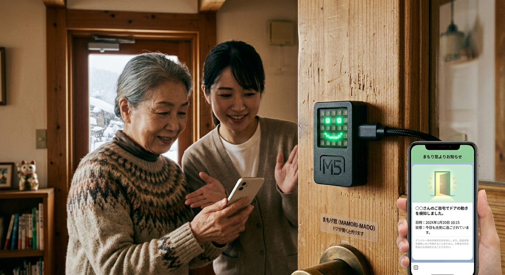

# IoT作品 企画書

## 1. 作品名
**「まもり窓（MAMORI-MADO） ～ はる、光る、つながる。ドアの揺れで届ける『ゆるやか見守り』システム ～」**
*(※「M5Atom Matrix」の「マトリックス（窓）」と、高齢者宅のドアに「貼る」手軽さを掛け合わせた名称。用途に合わせて変更可能)*

---

## 2. 解決したい社会問題（背景・動機）

### 新潟の「豪雪」と「孤独死・孤立死」の深刻化
冬の新潟、特に豪雪地帯では雪により外出が困難になり、一人暮らしの高齢者が社会から完全に孤立してしまうリスクが非常に高まります。万が一、室内で体調を崩しても誰にも気づかれない「孤立死」が全国的な社会問題となっています。

### 既存の見守りカメラが抱える「プライバシー問題」
安否確認のために室内に見守りカメラを設置するケースもありますが、被視聴者（高齢者）にとっては「24時間監視されているようでストレス」「プライバシーがない」という強い拒絶感があり、導入が進まない大きな壁になっています。

---

## 3. 作品概要（コンセプト）
本作品は、超小型IoTデバイス「M5Atom Matrix」のみを使用し、カメラを一切使わずに高齢者の生活リズムを『ゆるやか』に見守るシステムです。

高齢者が毎日必ず開閉する「トイレのドア」や「冷蔵庫の扉」にデバイスを貼り付けるだけで、プライバシーを100%守りながら、離れて暮らす家族や地域社会へ「今日も元気にしています」という安心を届けます。

### 利用イメージ

---

## 4. システムの仕組み（仕様）
はんだ付けや外部センサーの追加は一切不要。M5Atom Matrixに内蔵された機能をフル活用します。

* **揺れの検知（入力）：**
    ドアの開閉時に発生する微小な振動を、M5Atom Matrixに内蔵されている「6軸IMU（加速度・ジャイロセンサー）」で検知します。
* **現場での視覚的フィードバック（出力1）：**
    ドアが開閉されると、本体の5×5 LEDマトリックスが「緑色のニコちゃんマーク（☺）」にパッと光ります。これにより、高齢者自身も「今日もシステムが自分を見守ってくれている」と実感でき、双方向の安心感が生まれます。
* **遠隔地への通知（出力2）：**
    M5Atomの内蔵Wi-Fiチップを使い、インターネット経由で「LINE」などの通知サービスと連携します。
    * **日常の安心：** ドアが動いた履歴をクラウドに蓄積。
    * **異常のアラート：** 「最後にドアが動いてから24時間、一度も振動を検知しない」という異常事態が起きた場合、離れて暮らす家族や民生委員のLINEへ「〇〇さんの家のドアが24時間動いていません。確認してください」と自動で緊急通知（Flex Message等）を送ります。

---

## 5. 作品の特長（アピールポイント）

### ① 「はんだ付けゼロ・1ステップ」の圧倒的な導入ハードルの低さ
外部センサーを一切接続しないため、故障リスクが極めて低く、断線の心配もありません。本体に両面テープを貼ってドアに固定するだけで設置が完了するため、機械が苦手な高齢者宅や、福祉の現場でもすぐに導入可能です。

### ② プライバシーへの究極の配慮（ゆるやかな安心）
画像や音声は一切取得せず、「ドアが動いたかどうか」という数値データのみを扱います。監視されている圧迫感が全くないため、高齢者側の心理的ハードルを下げ、「これなら設置していいよ」と言ってもらえるデザイン思想を持っています。

### ③ プレゼン・展示映えする「5×5 LED」の活用
コンテストのデモ画面や動画において、ドアを模した板を動かすと、M5Atom Matrixが可愛らしくドット絵（ニコちゃんマークやハートマークなど）で反応する様子は、審査員への視覚的なアピール度（キャッチーさ）が抜群です。

---

## 6. 今後の展望（さらなる発展性）

### 豪雪時の「雪下ろしSOSボタン」機能の追加
M5Atomの表面は大きな1つの「ボタン」になっています。急な大雪で体調を崩したり、雪下ろしができなくて困ったりした際、このボタンを3秒長押しすると「雪下ろしSOS」として地域のボランティアにLINEが飛ぶような、雪国特化型のアップデートも容易に可能です。